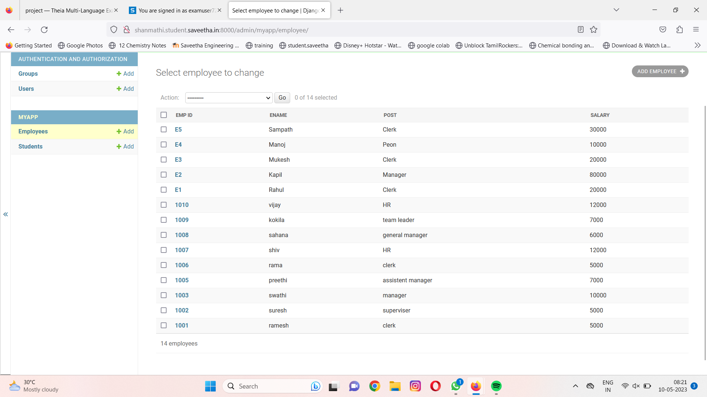
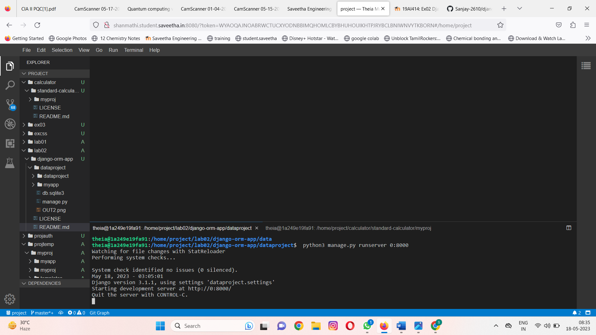

# Django ORM Web Application

## AIM
To develop a Django application to store and retrieve data from a database using Object Relational Mapping(ORM).

## DESIGN STEPS

### STEP 1:
Create django application

### STEP 2:
Write code in models.py and admin.py

### STEP 3:
End of the program

## PROGRAM

# models.py
```
from django.db import models
from django.contrib import admin

class Student (models.Model):
    referencenumber=models.CharField(max_length=20,help_text="reference number")
    name=models.CharField(max_length=100)
    age=models.IntegerField()
    email=models.EmailField()

class StudentAdmin(admin.ModelAdmin):
    list_display=('referencenumber','name','age','email')

class Employee (models.Model):
   emp_id=models.CharField(primary_key=True,max_length=4,help_text='Employee ID')
   ename=models.CharField(max_length=50)
   post=models.CharField(max_length=20)
   salary=models.IntegerField()

class EmployeeAdmin(admin.ModelAdmin):
    list_display=('emp_id','ename','post','salary')
```

# admin.py
```
from django.contrib import admin
from .models import Student,StudentAdmin,Employee,EmployeeAdmin

admin.site.register(Student,StudentAdmin)
admin.site.register(Employee,EmployeeAdmin)
```

## OUTPUT

# Client output:


# Server Output:


## RESULT
Program executed successfully.